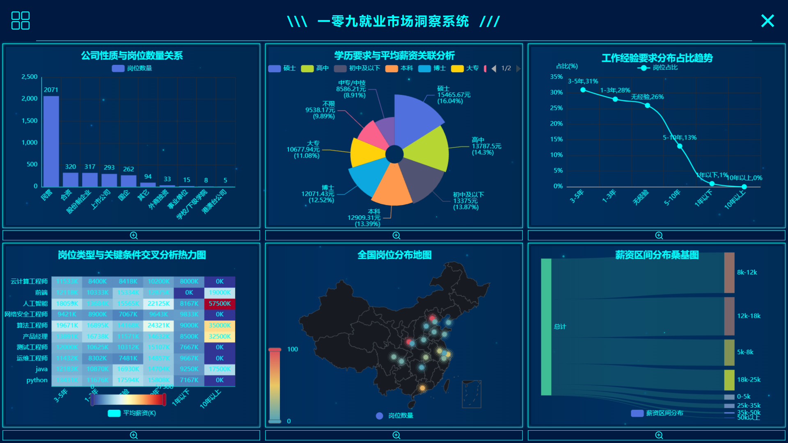
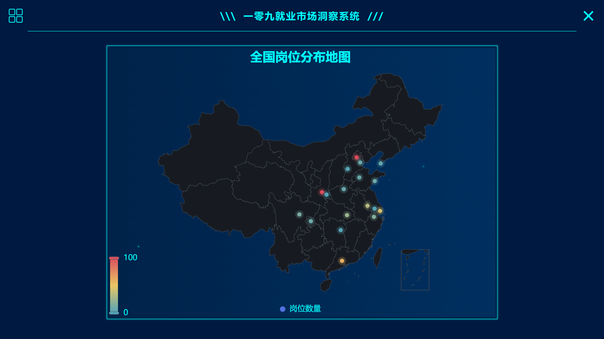

# 计算机相关岗位数据可视化系统

## 项目简介

本项目是一个基于 Python 和 PyQt6 的计算机相关岗位数据可视化系统，通过对岗位数据进行多维度分析，帮助用户更好地了解就业市场趋势。系统提供了丰富的可视化图表，包括薪资分布、地区分布、学历要求与薪资关联等多个维度的分析。

## 功能特点

- **多维度数据分析**：提供薪资区间分布、地区岗位分布、学历要求与薪资关联、经验要求分布、公司性质与薪资/岗位数量关联、岗位类型与关键条件交叉分析等六大维度。
- **丰富的图表类型**：支持柱状图、饼图、折线图、桑基图、热力图、地理分布图等多种图表类型。
- **现代化界面**：采用 PyQt6 构建图形用户界面，具有良好的用户体验。
- **交互式可视化**：集成 ECharts 引擎，提供交互式的图表体验。

## 可视化维度

| 可视化主题 | 图表类型 | 核心价值 |
| --- |------| --- |
| 薪资区间分布 | 桑基图  | 直观呈现不同薪资段的岗位数量占比，快速判断薪资集中范围 |
| 地区岗位分布 | 地理分布图  | 展示不同地区的岗位数量差异，明确地理集中趋势 |
| 学历要求与薪资关联 | 饼图   | 对比不同学历对应的薪资区间差异，量化学历对薪资的影响 |
| 经验要求分布 | 折线图  | 呈现经验要求集中情况，适配求职人群定位 |
| 公司性质与薪资/岗位数量关联 | 柱状图  | 对比不同公司性质的岗位数量和薪资水平 |
| 岗位类型与关键条件交叉分析 | 热力图  | 挖掘岗位与学历、薪资、经验的交叉关系 |

## 技术栈

- **编程语言**：Python 3.11
- **GUI框架**：PyQt6
- **可视化引擎**：PyECharts
- **数据处理**：Pandas, NumPy
- **Web渲染**：QtWebEngine
- **爬虫技术**：requests

## 项目地址

项目已托管在 GitHub 上：[https://github.com/YLJ109/infoVisaul](https://github.com/YLJ109/infoVisaul)

## 安装依赖

```bash
git clone https://github.com/YLJ109/infoVisaul.git
cd infoVisaul
pip install -r requirements.txt
```

## 使用 Docker 运行（推荐）

为了简化环境配置，本项目提供了 Docker 支持。

### 构建 Docker 镜像

```bash
cd docker
docker build -t infovisaul .
```

### 运行 Docker 容器

在Linux系统上运行GUI应用程序：
```bash
cd docker
docker run -it --rm -e DISPLAY=$DISPLAY -v /tmp/.X11-unix:/tmp/.X11-unix infovisaul
```

在Windows或macOS系统上运行GUI应用程序：
```bash
# Windows (需要安装并运行XServer，例如VcXsrv)
docker run -it --rm -e DISPLAY=host.docker.internal:0 infovisaul

# macOS (需要安装并运行XQuartz)
docker run -it --rm -e DISPLAY=docker.for.mac.host.internal:0 infovisaul
```

### 使用 docker-compose 运行

```bash
cd docker
docker-compose up
```

### 通过VNC访问（跨平台方案）

容器还内置了VNC服务器，可以通过VNC客户端连接访问GUI界面：
1. 启动容器：`docker-compose up`
2. 使用VNC客户端连接 localhost:5900
3. 默认密码为: password

注意：在 Windows 或 macOS 上运行 GUI 应用程序可能需要额外的配置，具体取决于您的 Docker 环境。

## 运行项目

```bash
python app.py
```

## 项目结构

```
infoVisaul/
├── app.py                  # 程序入口
├── requirements.txt        # 依赖包列表
├── README.md               # 项目说明文档
├── LICENSE                 # 许可证文件
├── backup/                 # 备份文件目录
├── data_cleaning/          # 数据清洗脚本
│   ├── data_cleaning_script.py  # 数据清洗主脚本
│   ├── zhilian_computer_jobs.csv # 原始数据文件
│   └── cleaned_zhilian_jobs.csv # 清洗后数据文件
├── user_info/              # 用户信息存储
│   ├── saved_credentials.json   # 保存的用户凭据
│   └── userInfo.json       # 用户信息
├── visual/                 # 可视化模块
│   ├── page/               # 页面UI
│   │   ├── login_window.py      # 登录窗口
│   │   ├── register_window.py   # 注册窗口
│   │   └── visual_window.py     # 主可视化窗口
│   ├── view/               # 图表可视化实现
│   │   ├── Code_Template.py                     # 图表模板
│   │   ├── CompanyType_Salary_Visualization.py  # 公司性质与薪资关联可视化
│   │   ├── Education_Salary_Visualization.py    # 学历与薪资关联可视化
│   │   ├── Experience_Requirement_Distribution_Visualization.py # 经验要求分布可视化
│   │   ├── Job_Type_Key_Requirements_Visualization.py # 岗位类型与关键条件交叉分析可视化
│   │   ├── Regional_Job_Visualization.py        # 地区岗位分布可视化(旧版)
│   │   ├── Regional_Job_Visualization2.py       # 地区岗位分布可视化(新版-地理分布图)
│   │   └── Salary_Range_Visualization.py        # 薪资区间分布可视化
│   ├── static/             # 静态资源文件
│   │   ├── data/           # 数据文件目录
│   │   │   └── cleaned_zhilian_jobs.csv         # 清洗后的数据文件
│   │   ├── img/            # 图片资源目录
│   │   └── js/             # JavaScript文件目录
│   │       ├── echarts.min.js                   # ECharts库文件
│   │       └── china.js                         # 中国地图数据文件
│   └── setting.py          # 配置文件
├── web_crawler/            # 网络爬虫脚本
│   └── crawler_script.py   # 爬虫主脚本
├── docker/                 # Docker 配置文件
│   ├── Dockerfile          # Docker 配置文件
│   ├── docker-compose.yml  # Docker Compose 配置文件
│   ├── start.sh            # Docker 容器启动脚本
│   ├── build_docker.bat    # Windows Docker 镜像构建脚本
│   └── run_docker.bat      # Windows Docker 容器运行脚本
└── page_img/               # 界面截图目录
    ├── login_page.png      # 登录界面截图
    ├── register_page.png   # 注册界面截图
    └── visual_window.png   # 主可视化界面截图
```

## 主要模块介绍

- **登录注册模块**：用户身份验证和管理
- **数据清洗模块**：对原始数据进行预处理
- **可视化展示模块**：各类图表的实现和展示
  - 地理分布图：展示全国各省市的岗位分布情况
  - 桑基图：展示薪资区间的分布情况
  - 饼图：展示学历要求与薪资的关联关系
  - 折线图：展示经验要求的分布情况
  - 柱状图：展示公司性质与薪资/岗位数量的关联关系
  - 热力图：展示岗位类型与关键条件的交叉分析
- **网络爬虫模块**：获取最新的职位招聘信息

## 系统截图





## 开发计划

- [ ] 增加更多的数据源支持
- [ ] 提供数据导出功能
- [ ] 支持自定义图表配置
- [ ] 增加数据对比分析功能
- [ ] 优化用户界面交互体验

## 贡献指南

欢迎提交 Issue 和 Pull Request 来改进本项目。

## 许可证

本项目采用 MIT 许可证，详情请参见 [LICENSE](LICENSE) 文件。